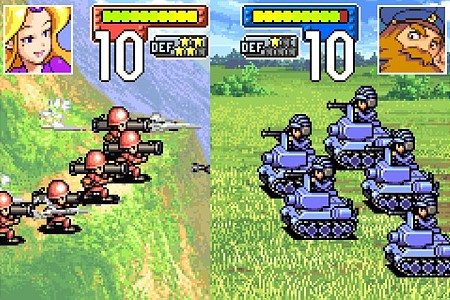

狂野草原
======
======

主题
----

在草原上收集各种动物，通过战斗培养它们的种群，并获得收集更多物种，最终打败凶残的最终BOSS！！！草泥马！！！

游戏种类
----

战棋 + 养成

战斗方式
----

1. 游戏分为不同关卡，每个关卡为一场战斗。战斗是在俯视角棋盘类地图上进行，每场战斗玩家拥有N(以关卡定)种动物，每种动物有M只(取决于之前战斗经历)。战斗目标是打败地图上其他动物。

2. 行动方式是玩家控制自己的动物在棋盘上移动，如果接触敌人就进入交锋模式

3. 进入交锋模式后，画面从棋盘地图切换到交战画面：画面为侧面视角，动物永远以侧面显示在画面中。参考超级大战争的战斗模式： 
不同于上图的是，画面两边是连通的，双方动物从画面两端不可见区域冲进画面并冲向中央，系统计算比较两边的物种冲击力*动物数量，数值大的一方会碾压过数值低的一方，大的一方胜利。

4. 赌博要素：交战模式中，两边动物数量真实显示，但是敌人数量是隐藏的。双方排成方阵冲入场内，所以在交战开始时，玩家并不知道对手强弱，只有对手完全进入视野内才能判断。与此同时，玩家感觉无法获胜时可以选择逃跑。但是双方一旦接触，系统就会计算胜负，所以如果逃跑不及时，玩家同样会输。

5. 交战结果：如果玩家获胜，则保留自己的物种，同时，如果敌人与自己同一个物种，那么该物种种群获得扩大。如果玩家失败，则该物种在本关卡中无法继续使用，同时玩家拥有的该物种种群数量降低。

6. 每一关都有一个主要种群，挑战关卡完美成功（己方无种群战败），可以获得该种群。

核心游戏性
----

游戏核心乐趣在于赌博要素和交战画面的画面冲击力。 
与此同时：可以挖掘的潜力有策略要素（比如地图上的地形，关卡布阵），养成要素，收集要素...

物种
----
可供选择：狐獴，兔子，猫，鹿，野猪，非洲野狗，狼，鸵鸟，斑马，野牛，长劲鹿，豹，獅子，大羚羊，犀牛，非洲象，草泥马...

游戏初始，玩家可以从狐獴，兔子，猫中选择一个物种。